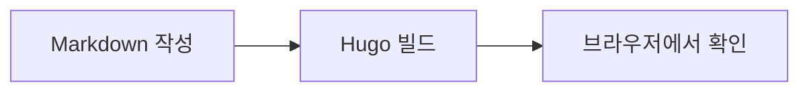
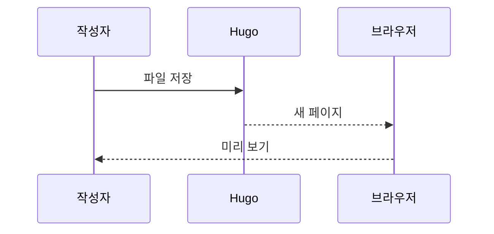

코드 오른쪽의 복사·접기 버튼과 아래 탭을 눌러 보세요.
이 페이지는 `katex: true`, `mermaid: true`로 관련 기능을 활성화했습니다.

## 파일명·줄 번호·강조

```python {filename="sum.py" linenos=true hl_lines=[2]}
def add(a, b):
    return a + b

print(add(20, 22))
```

여는 코드 펜스에 아래처럼 언어와 옵션을 붙입니다.

````text
```python {filename="sum.py" linenos=true hl_lines=[2]}
````

## 처음부터 접힌 코드

```yaml {filename="sample.yaml" collapsed=true}
site:
  title: Narrow examples
  language: ko
  features:
    markdown: true
    alerts: true
    tabs: true
    code: true
    gallery: true
    math: true
    diagrams: true
```

`collapsed=true`로 초기 상태를 지정합니다.
긴 코드는 테마의 자동 접기 설정도 적용받습니다.

## 탭 안의 본문과 코드




탭은 코드 전용이 아닙니다. **문장**, 목록, 코드 등을 담을 수 있습니다.

- 첫 번째 탭입니다.
- 키보드로도 탭을 이동해 보세요.




```python
print(sum([1, 2, 3]))
```




```cpp
#include <iostream>
int main() {
    std::cout << 1 + 2 + 3 << '\n';
}
```




```text


여기에 Markdown을 씁니다.


두 번째 내용입니다.


```

## KaTeX 수식

인라인 수식은 $E = mc^2$처럼 씁니다.

$$
\sum_{i=1}^{n} i = \frac{n(n+1)}{2}
$$

```latex
$E = mc^2$

$$
\sum_{i=1}^{n} i = \frac{n(n+1)}{2}
$$
```

## Mermaid 흐름도



## Mermaid 시퀀스 다이어그램



언어를 `mermaid`로 지정한 코드 블록이 다이어그램이 됩니다.
KaTeX와 Mermaid는 테마에서 CDN 스크립트를 불러오므로 인터넷 연결이 필요합니다.
