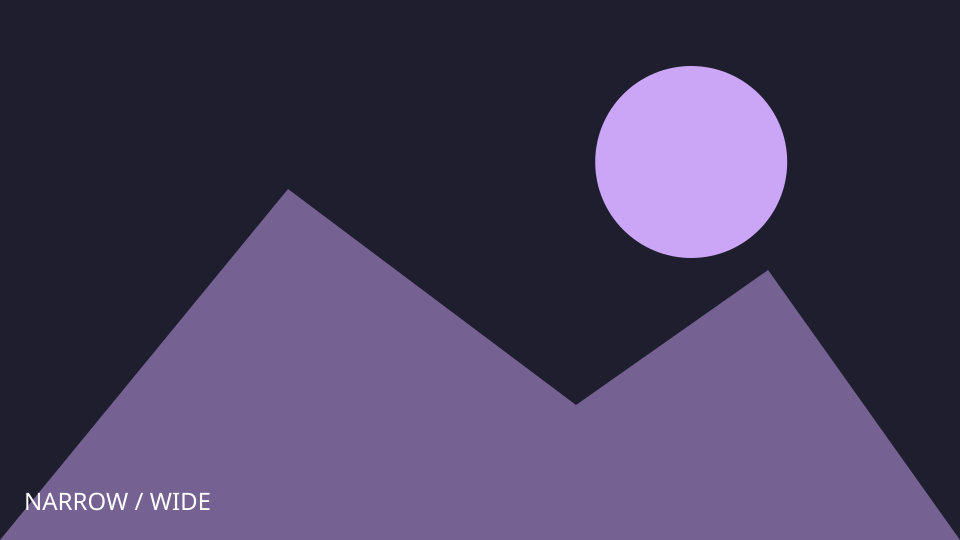
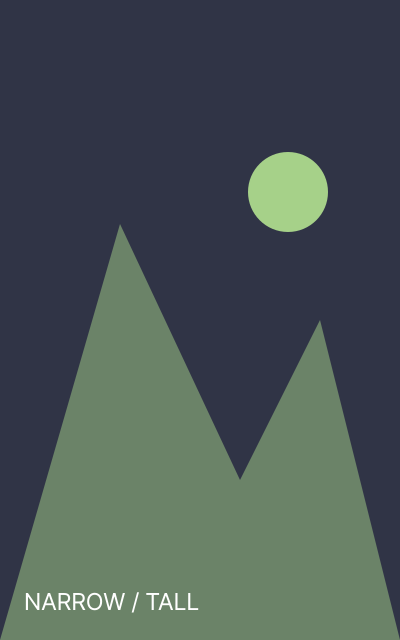
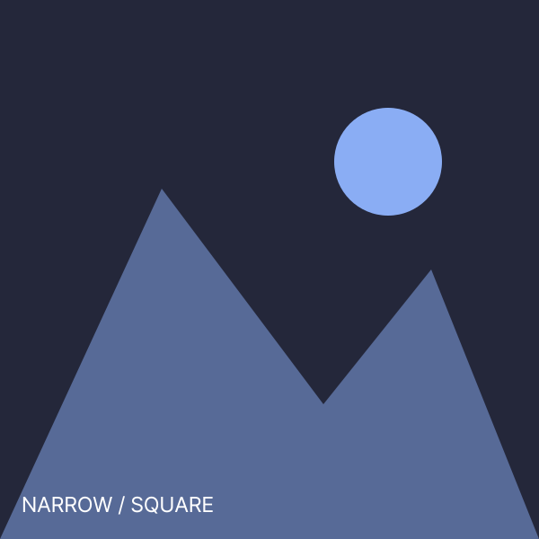

글 위의 큰 이미지는 `cover: cover.svg`로 지정했습니다.
[글 목록](/posts/)에서도 이 글의 썸네일을 확인하세요.
표지와 목록 썸네일이 같은 설정을 사용합니다.

## 글과 이미지 묶기

```text
content/posts/reference/narrow-images/
  index.md
  cover.svg
  portrait.svg
  square.svg
```

이 예제 이미지는 기능 확인용으로 직접 만든 SVG입니다.
갤러리에는 이미지 크기를 안정적으로 읽을 수 있도록 PNG 변환본을 사용했습니다.
실제 글에서는 JPG, PNG, WebP 같은 사진을 넣어도 됩니다.

## 이미지 한 장과 캡션



```markdown

```

대괄호는 대체 텍스트이고 따옴표는 캡션입니다.
이미지를 눌러 라이트박스를 열고 확대·이동·닫기를 시험해 보세요.

## 여러 이미지의 자동 갤러리






연속된 이미지들은 갤러리로 묶입니다. 갤러리의 레이아웃 버튼을 눌러
**justified**(행 높이를 맞춤), **masonry**(벽돌형), **grid**(격자형)를 비교하세요.
이미지 사이에 설명 문단을 넣으면 별도 그룹으로 나눌 수 있습니다.

```yaml
cover: cover.svg
gallery:
  enabled: true
  defaultLayout: justified
  gap: 10
  columns: 3
  targetRowHeight: 200
  lastRowBehavior: center
lightbox:
  enabled: true
```

`gallery.enabled: false`면 자동 갤러리를 끄고,
`lightbox.enabled: false`면 클릭 확대를 끕니다.
과거 예제의 `justified_gallery` 대신 현재 구현의 `gallery`를 사용하세요.

## 전역 이미지 경로

글 전용 이미지는 같은 bundle 안에 두세요.
여러 글에서 쓰는 이미지는 `static/images/`에 넣고
`/images/파일명.svg`로 참조할 수도 있습니다.

외부 이미지 URL도 지원하지만 원본 사이트 상태에 영향을 받습니다.
